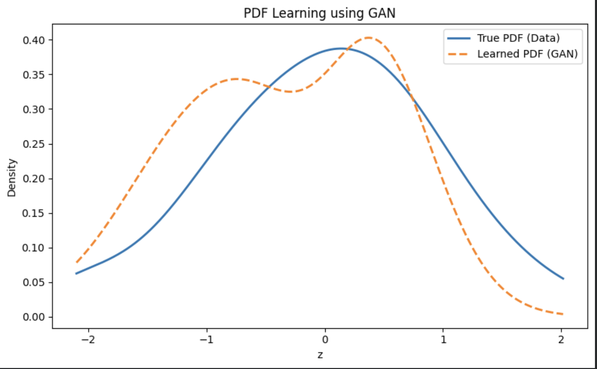

# PDF Learning Using Generative Adversarial Network (GAN)

## Objective
To learn the probability density function (PDF) of a transformed random variable **using data samples only**, without assuming any analytical or parametric distribution, by training a Generative Adversarial Network (GAN).

---

## Dataset
- **Dataset:** India Air Quality Dataset (Kaggle)
- **Feature Used:** NO₂ concentration
- Missing values were removed before processing.

---

## Transformation of Random Variable

Each NO₂ value \( x \) is transformed as:

\[
z = x + a_r * sin(b_r * x)
\]

where the parameters depend on the university roll number \( r \):

\[
a_r = 0.5 * (r mod 7), 
b_r = 0.3 * ((r mod 5) + 1)
\]

### Roll Number
let's say r

### Computed Parameters
- \( a_r = 0 \)
- \( b_r = 0.3 \)

### Final Transformation
\[
z = x
\]

Although the transformation reduces to identity for this roll number, the task of **learning the PDF from samples remains valid**, as no parametric form of the distribution is assumed.

---

A **simple GAN** was used, which is appropriate and stable for **1-dimensional density estimation**.

### Generator
- Input: Gaussian noise 
- Fully connected layers with ReLU activation
- Output: Generated samples \( z_f \)

### Discriminator
- Input: Real or generated samples
- Fully connected layers with LeakyReLU activation
- Sigmoid output representing probability of being real

### Training Configuration
- Loss Function: Binary Cross-Entropy (BCE)
- Optimizer: Adam
- Learning Rate: 2 × 10⁻⁴
- Batch Size: 256
- Epochs: 2000

Training was stable with no mode collapse.

---

## PDF Estimation from GAN Samples

After training:
1. A large number of samples were generated from the Generator.
2. Kernel Density Estimation (KDE) was applied to the generated samples.
3. The learned PDF was compared against the KDE of the real transformed data.

### Resulting PDF Plot

  

---

## Observations

### Mode Coverage
- The GAN successfully captures the dominant mode of the true distribution.
- No mode collapse is observed.

### Training Stability
- Generator and Discriminator losses converge smoothly.
- Loss values indicate a stable adversarial equilibrium.

### Quality of Generated Distribution
- The learned PDF closely follows the overall shape and spread of the true PDF.
- Minor deviations are expected due to finite samples and KDE-based visualization.
- The GAN learns the distribution **implicitly**, without any parametric assumptions.

---

## Conclusion
The experiment demonstrates that a GAN can effectively learn an **implicit probability density function** using only data samples.  
The trained model captures the global structure and dominant characteristics of the true distribution in a stable and interpretable manner.

---

